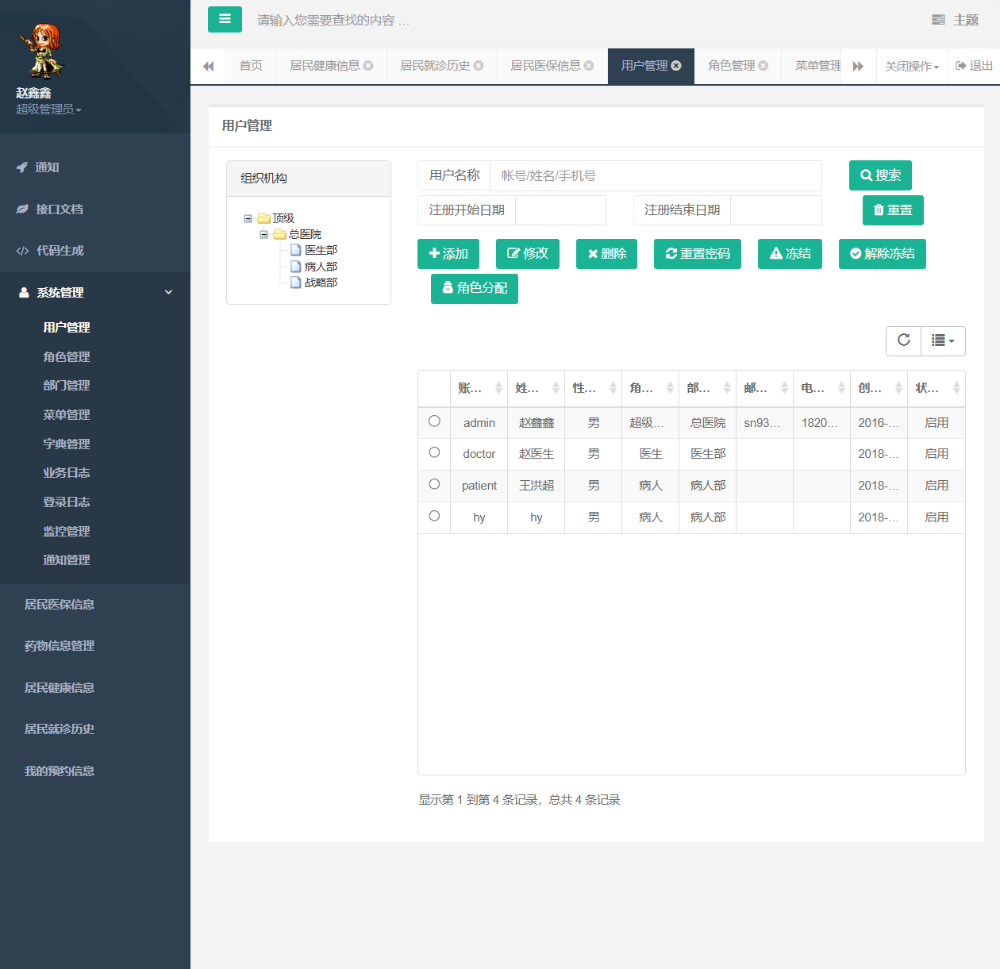
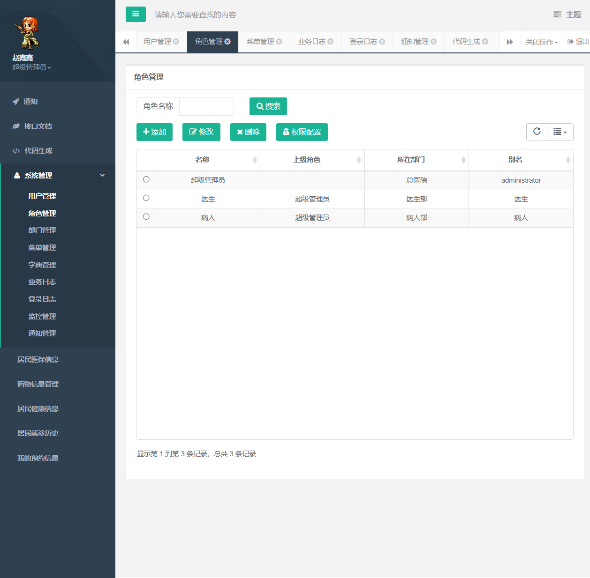
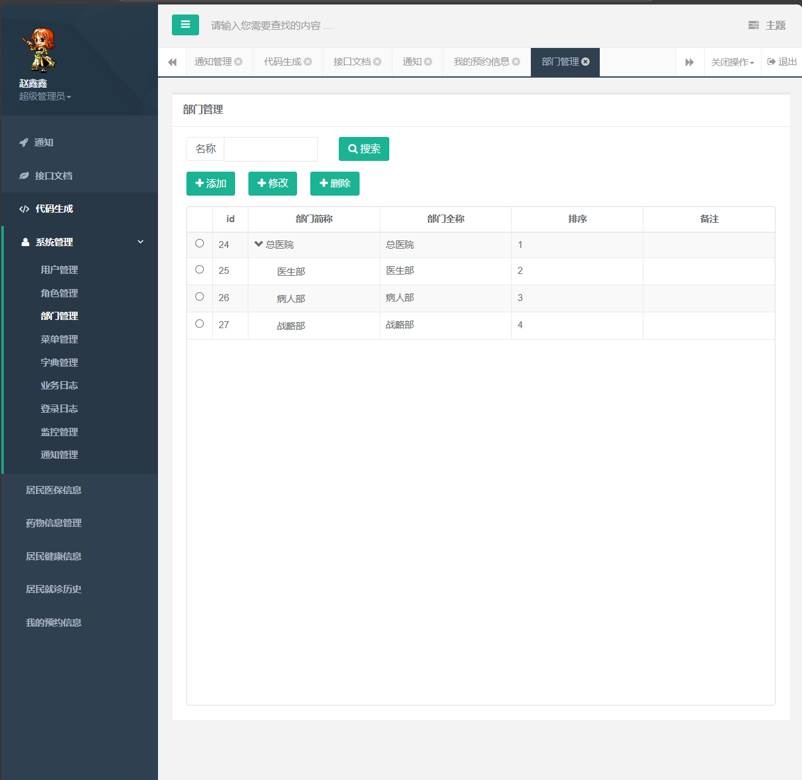
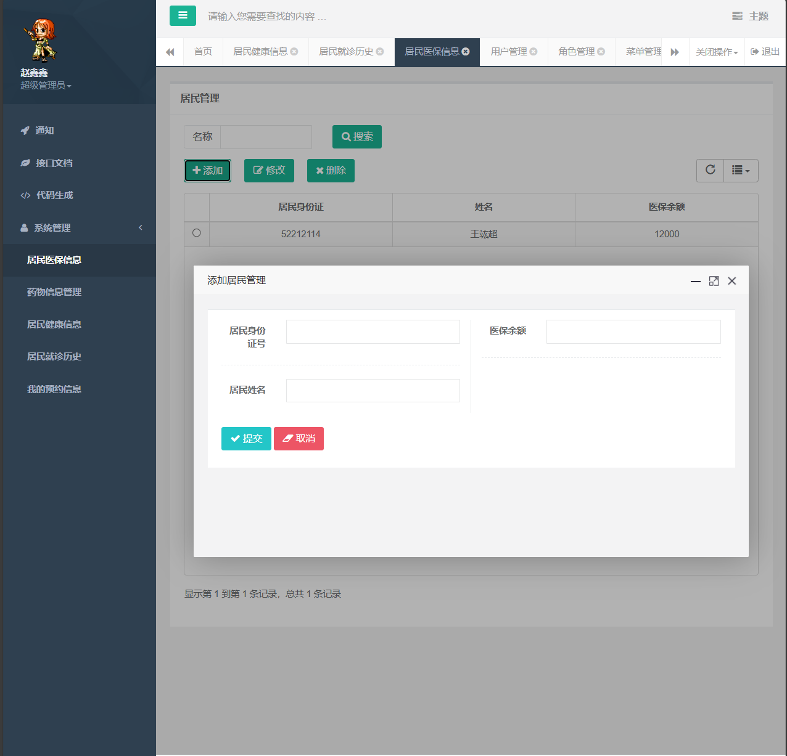
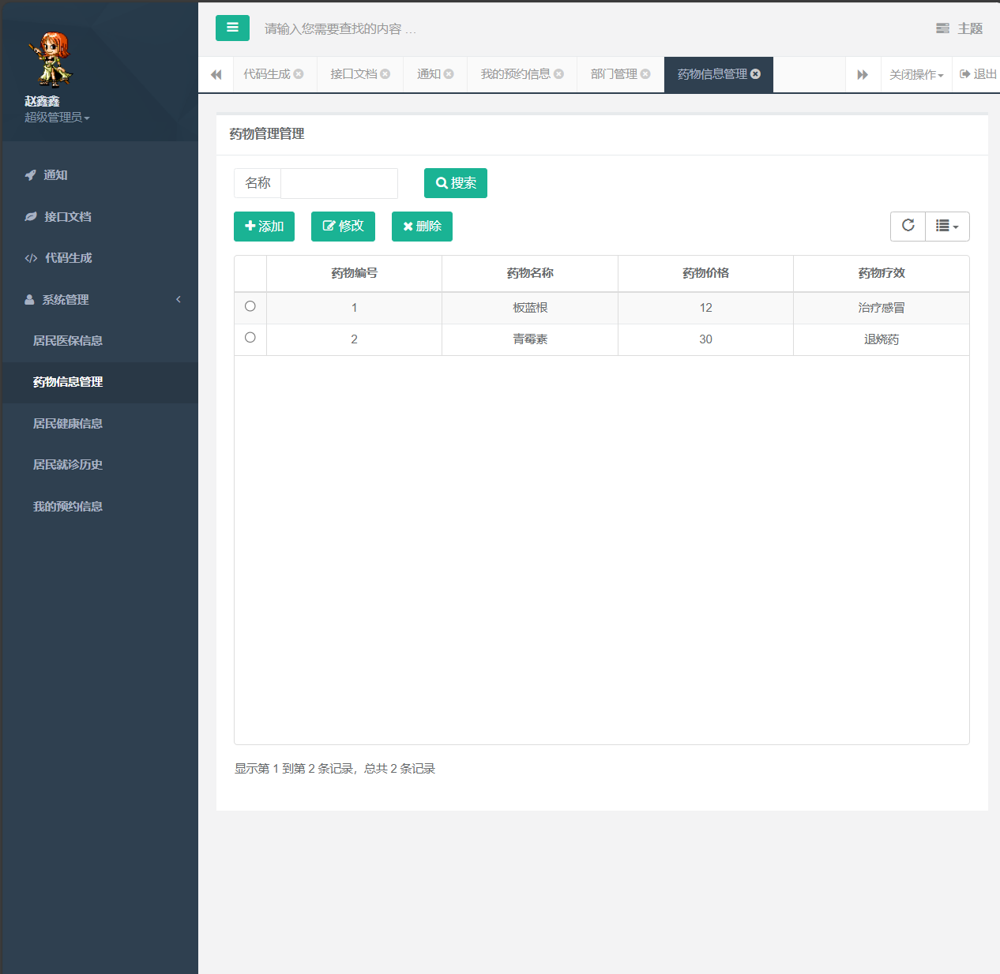
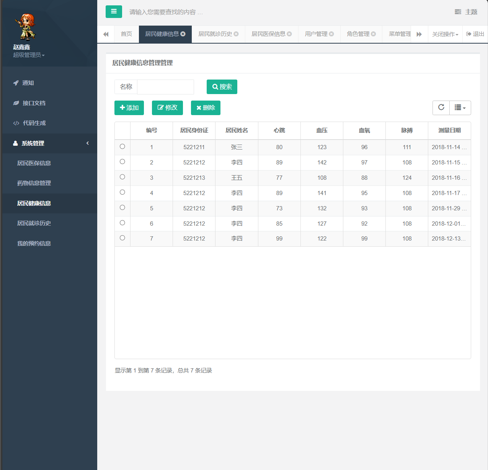
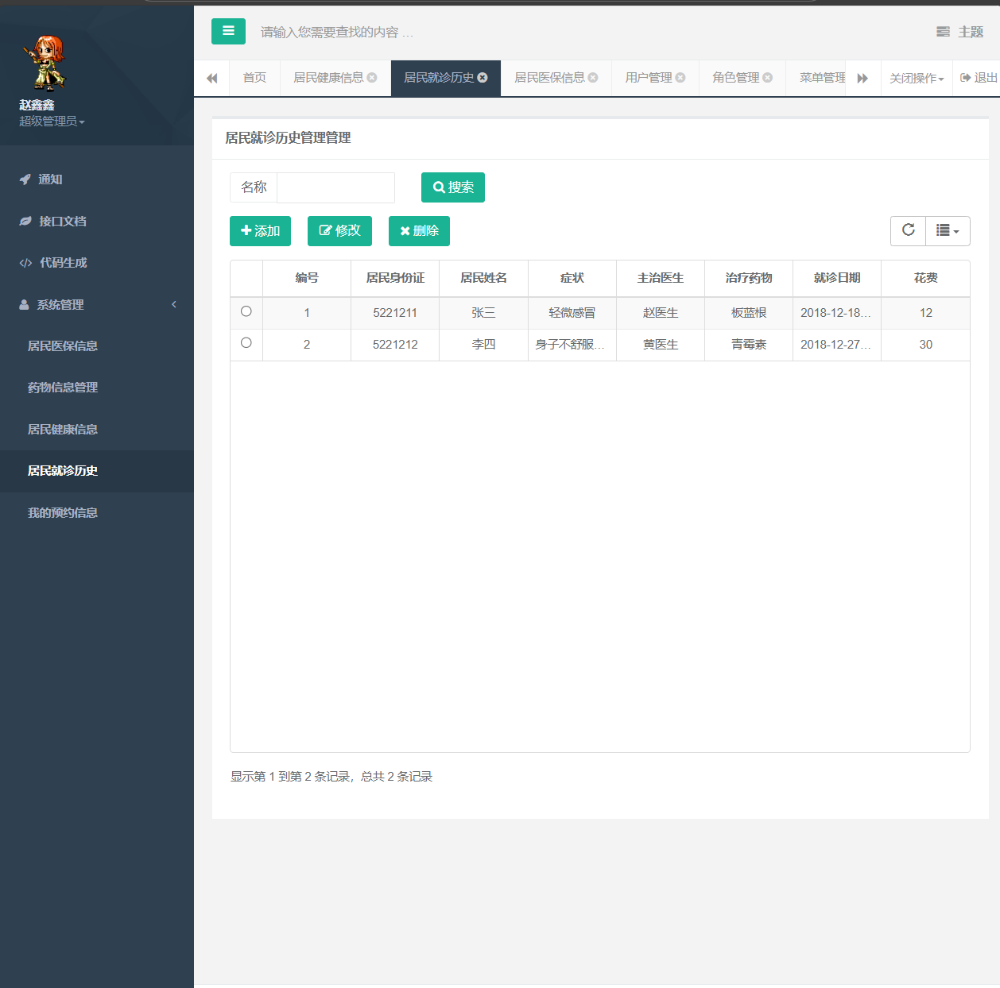
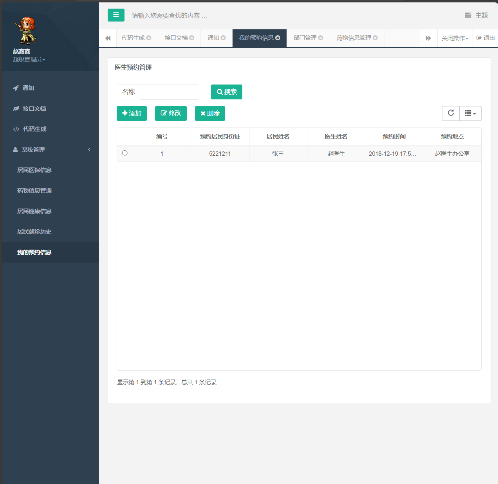

# 18-医疗养老系统

```
常年接毕设，如需完整毕设项目或远程部署服务+v: Ai1763591756
```


### 功能介绍：

1. **用户管理**
2. **角色管理**
3. **部门管理**
4. **菜单管理**
5. **居民医保信息管理**
6. **药物信息管理**
7. **居民健康信息**
8. **居民就诊管理**
9. **我的预约信息**

## 后端  

    1. idea 打开项目，等待自动下载依赖完成；  
    2.（非必须）idea 打开 File -> Setting -> Build, Execution, Deployment -> Build Tools -> Maven;  
    Maven home directory 选项  导入 maven 文件;  

## 启动  

    生产环境：  
      启动相应的入口文件

## 数据库：  

    根目录下的 guns.sql, 直接导入即可;  
    可在 application.properties 文件下更改数据库账号密码，默认为： 账号：root， 密码：password;  

###   账号信息   

```
username:admin
password:111111
```

### 接口代码

```java
/**
 * Copyright 2018-2020 stylefeng & fengshuonan (https://gitee.com/stylefeng)
 * <p>
 * Licensed under the Apache License, Version 2.0 (the "License");
 * you may not use this file except in compliance with the License.
 * You may obtain a copy of the License at
 * <p>
 * http://www.apache.org/licenses/LICENSE-2.0
 * <p>
 * Unless required by applicable law or agreed to in writing, software
 * distributed under the License is distributed on an "AS IS" BASIS,
 * WITHOUT WARRANTIES OR CONDITIONS OF ANY KIND, either express or implied.
 * See the License for the specific language governing permissions and
 * limitations under the License.
 */
package cn.stylefeng.guns.modular.api;

import cn.stylefeng.guns.core.shiro.ShiroKit;
import cn.stylefeng.guns.core.shiro.ShiroUser;
import cn.stylefeng.guns.core.util.JwtTokenUtil;
import cn.stylefeng.guns.modular.system.dao.UserMapper;
import cn.stylefeng.guns.modular.system.model.User;
import cn.stylefeng.roses.core.base.controller.BaseController;
import cn.stylefeng.roses.core.reqres.response.ErrorResponseData;
import org.apache.shiro.authc.SimpleAuthenticationInfo;
import org.apache.shiro.authc.UsernamePasswordToken;
import org.apache.shiro.authc.credential.HashedCredentialsMatcher;
import org.apache.shiro.crypto.hash.Md5Hash;
import org.apache.shiro.util.ByteSource;
import org.springframework.beans.factory.annotation.Autowired;
import org.springframework.web.bind.annotation.RequestMapping;
import org.springframework.web.bind.annotation.RequestMethod;
import org.springframework.web.bind.annotation.RequestParam;
import org.springframework.web.bind.annotation.RestController;

import java.util.HashMap;

/**
 * 接口控制器提供
 */
@RestController
@RequestMapping("/gunsApi")
public class ApiController extends BaseController {

    @Autowired
    private UserMapper userMapper;

    /**
     * api登录接口，通过账号密码获取token
     */
    @RequestMapping("/auth")
    public Object auth(@RequestParam("username") String username,
                       @RequestParam("password") String password) {

        //封装请求账号密码为shiro可验证的token
        UsernamePasswordToken usernamePasswordToken = new UsernamePasswordToken(username, password.toCharArray());

        //获取数据库中的账号密码，准备比对
        User user = userMapper.getByAccount(username);

        String credentials = user.getPassword();
        String salt = user.getSalt();
        ByteSource credentialsSalt = new Md5Hash(salt);
        SimpleAuthenticationInfo simpleAuthenticationInfo = new SimpleAuthenticationInfo(
                new ShiroUser(), credentials, credentialsSalt, "");

        //校验用户账号密码
        HashedCredentialsMatcher md5CredentialsMatcher = new HashedCredentialsMatcher();
        md5CredentialsMatcher.setHashAlgorithmName(ShiroKit.hashAlgorithmName);
        md5CredentialsMatcher.setHashIterations(ShiroKit.hashIterations);
        boolean passwordTrueFlag = md5CredentialsMatcher.doCredentialsMatch(
                usernamePasswordToken, simpleAuthenticationInfo);

        if (passwordTrueFlag) {
            HashMap<String, Object> result = new HashMap<>();
            result.put("token", JwtTokenUtil.generateToken(String.valueOf(user.getId())));
            return result;
        } else {
            return new ErrorResponseData(500, "账号密码错误！");
        }
    }

    /**
     * 测试接口是否走鉴权
     */
    @RequestMapping(value = "/test", method = RequestMethod.POST)
    public Object test() {
        return SUCCESS_TIP;
    }

}


```

### 医生预约接口

```java
package cn.stylefeng.guns.modular.doctor_point.controller;

import cn.stylefeng.roses.core.base.controller.BaseController;
import org.springframework.stereotype.Controller;
import org.springframework.web.bind.annotation.RequestMapping;
import org.springframework.web.bind.annotation.ResponseBody;
import org.springframework.ui.Model;
import org.springframework.web.bind.annotation.PathVariable;
import org.springframework.beans.factory.annotation.Autowired;
import cn.stylefeng.guns.core.log.LogObjectHolder;
import org.springframework.web.bind.annotation.RequestParam;
import cn.stylefeng.guns.modular.system.model.DoctorPoint;
import cn.stylefeng.guns.modular.doctor_point.service.IDoctorPointService;

/**
 * 医生预约控制器

 */
@Controller
@RequestMapping("/doctorPoint")
public class DoctorPointController extends BaseController {

    private String PREFIX = "/doctor_point/doctorPoint/";

    @Autowired
    private IDoctorPointService doctorPointService;

    /**
     * 跳转到医生预约首页
     */
    @RequestMapping("")
    public String index() {
        return PREFIX + "doctorPoint.html";
    }

    /**
     * 跳转到添加医生预约
     */
    @RequestMapping("/doctorPoint_add")
    public String doctorPointAdd() {
        return PREFIX + "doctorPoint_add.html";
    }

    /**
     * 跳转到修改医生预约
     */
    @RequestMapping("/doctorPoint_update/{doctorPointId}")
    public String doctorPointUpdate(@PathVariable Integer doctorPointId, Model model) {
        DoctorPoint doctorPoint = doctorPointService.selectById(doctorPointId);
        model.addAttribute("item",doctorPoint);
        LogObjectHolder.me().set(doctorPoint);
        return PREFIX + "doctorPoint_edit.html";
    }

    /**
     * 获取医生预约列表
     */
    @RequestMapping(value = "/list")
    @ResponseBody
    public Object list(String condition) {
        return doctorPointService.selectList(null);
    }

    /**
     * 新增医生预约
     */
    @RequestMapping(value = "/add")
    @ResponseBody
    public Object add(DoctorPoint doctorPoint) {
        doctorPointService.insert(doctorPoint);
        return SUCCESS_TIP;
    }

    /**
     * 删除医生预约
     */
    @RequestMapping(value = "/delete")
    @ResponseBody
    public Object delete(@RequestParam Integer doctorPointId) {
        doctorPointService.deleteById(doctorPointId);
        return SUCCESS_TIP;
    }

    /**
     * 修改医生预约
     */
    @RequestMapping(value = "/update")
    @ResponseBody
    public Object update(DoctorPoint doctorPoint) {
        doctorPointService.updateById(doctorPoint);
        return SUCCESS_TIP;
    }

    /**
     * 医生预约详情
     */
    @RequestMapping(value = "/detail/{doctorPointId}")
    @ResponseBody
    public Object detail(@PathVariable("doctorPointId") Integer doctorPointId) {
        return doctorPointService.selectById(doctorPointId);
    }
}

```


### 系统截图：
















